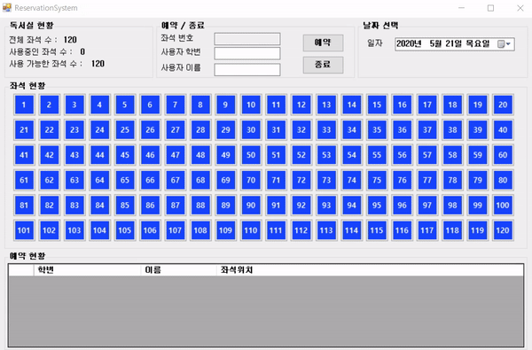

# reservation_system
독서실 예약관리 시스템입니다.

## 실행 화면

# 프로그램 상황

## issue

graphic 버퍼링 처리 (https://cw-wd.tistory.com/12)

## solve

hover시 랜더링속도 문제 ( Mousemove, Mouseleave로 깔끔하게 렌더링되게끔 처리했다.)

버튼 후버시 노란색으로 바꾸기 (mouse move leave로 해결,https://onlyican.tistory.com/183 )

클릭시에 노란색으로 바꾸기 (해결)

 Seat 전역 변수 120으로 세팅(전역변수로 선언해서 해결 )

클릭시의 노란색으로 바뀌는 거 유지하면서, hover가능하게 하기 (해결, 함수를 만들어서 유지하게했다, focused,)

사용중인 좌석 구하기 및 좌석 수 실시간 반영 로직 (delegate를 사용해서 해결했음 , 단, 컨트롤이 생기전(initalizeComponet()전)에 등록을 해주어야하는 것을 유의)

xml 클래스 예약현황, 좌석현황 두개로 나누기 (해결, 하나로 만들어도됨)

버튼의 태그 정보도 xml 로 저장할 수 있는가 ? (저장할 수 없다면, 기존의 btn.Text에서 가져왔던 로직도 바꿔서 하나의 클래스로 만들어야할 것 , 가능하지만,  좀 더 간편하게 하기 위해 클래스를 사용하였다.)

isused 클래스에넣어서 색깔안바뀌게하기 (Tag를 사용해서 체크를해야하는데 처음 세팅시와 xml 존재시 구분이 필요함 , 해결)

 true ,false로 좌석 사용가능 좌석 구하기 총 좌석 - 사용중 = 사용가능 한 좌석 (해결 )

회색버튼 클릭이 적용안됨 (해결)

xml불러오고 작성까지 (해결)

버튼과 학번 매칭 후 저장 (해결)

텍스트박스 ReadOnly에 경우 클릭안되게끔 (해결 true시 ReadOnly )

사용중일때는 회색으로 바꾸고 메시지 출력하기 (해결)

종료 버튼 구현 (dgv 데이터 삭제와 좌석 리스트 데이터를 동시에 삭제해주면서 좌석 버튼을 반영해주어야했다 , 해결)

SeatInfo  id pos int형으로 바꾸기 (기존 string으로 선언했던 클래스안 변수들을 활용에 맞게 int 로 수정 )

int에 null 값 초기화 (int ? nullable type 변수와 같이 선언해서 해결 )

Load()시  예외처리 (Load() ReadAllText로 가져오는 데, 없을때는 파일 생성을해주는 건 writeAllText()함수이기때문에 try catch로 잡아줬음  해결)

dateTimePick로 오늘 날짜만 데이터가 다 삭제되었다. (해결,그 이유는 xml이 없는 경우 pickTime으로 파일을 생성해야했는데, 현재시간으로 파일을 저장해서 생긴 이유였다 ) 

날짜바뀔때 로드된 데이터를 기준으로 버튼 색깔 로드 새로하기(해결, pickTime이 바뀔때마다 각 버튼의 isUsed값을 조회해서 색깔을 재지정해서 랜더링해주었다.)

date clear는 실제 파일 삭제를 하는 것이 아닌 로드된 데이터만 날린다. (해결)

xml 파일 날짜별로 분리해서 저장하기  (해결,하나로 파일을 합치면 파싱코드를 새로 구현하고 하나의파일을 한번에 로드 해야하기때문에 날짜별로 분리했다. 다양한 방법이 존재할 것으로 보임 )

dateTimePicker해서 날짜별로 다룰려면 현재 날짜에서 다루던 데이터내용이 다른날짜에 영향이 가지않도록 하기

(다시 로드해서 리스트 값을 재지정하고, UI안에 값들을 다시 재랜더링 해주었다.)

### 개선점

다음에는 버튼은 버튼만하고 버튼에 매칭된  다른 사용 정보들을 따로 클래스로 만들어 관리할것 버튼에 입력된 데이터로 웬만해서는 하지말기 

쓰레딩을 활용하기,  

### 기타사항

좌석 버튼을 클릭하면 노란색으로 바뀌는데, 다른좌석버튼에 hover시 포커스가 이동하므로, 이전에 선택한 좌석버튼에 버튼이 파랑색으로 변하는 issue가 있었다. 클릭한 좌석버튼은 항상 하나이므로 버튼 클래스 변수를 전역변수로 하나 설정하고 클릭할때 마다 그 변수에 할당해서 거기에 할당된 버튼은 무조건 노란색으로 바꾸기 전역변수에 등록되었다 해제되면, 다시 파랑색으로 바꿔주는 (사용중인 좌석은 회색이므로, 파랑색과 회색으로 분기해줘야하는 issue도 존재하였다) 로직도 추가 구현해야했다. 
